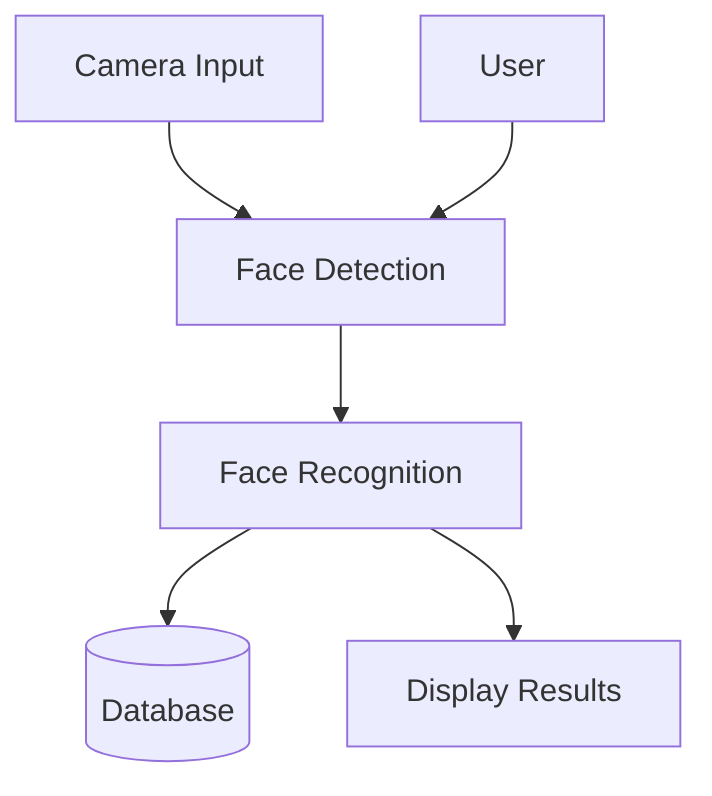
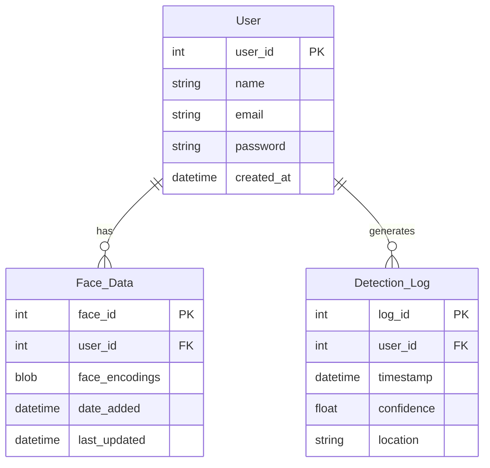
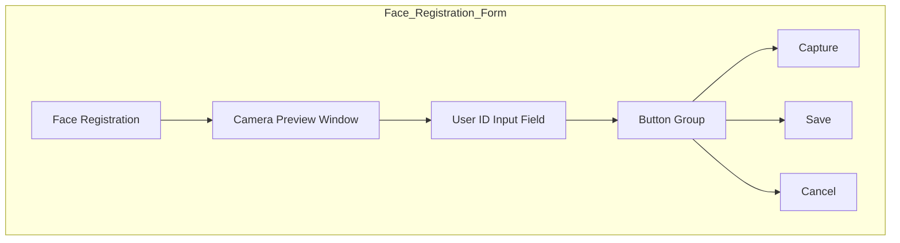
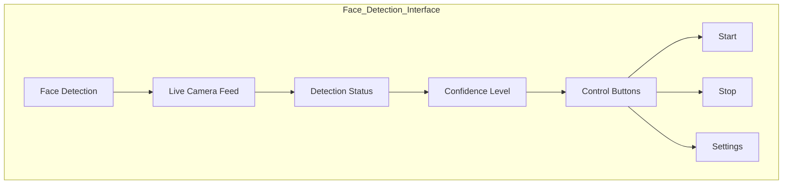
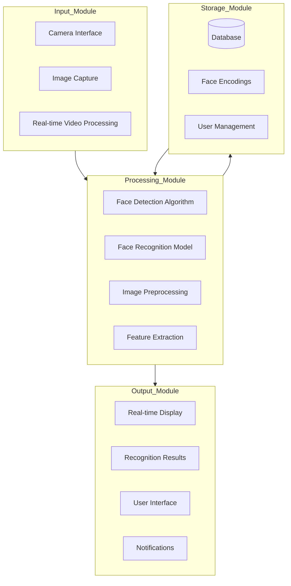

# Face Detection & Recognition System Design

## 1. Data Flow Diagram (DFD)

### Level 0 DFD


### Level 1 DFD


## 2. Entity Relationship (ER) Diagram


## 3. Database Table Design

### Users Table
```sql
CREATE TABLE users (
    user_id INT PRIMARY KEY AUTO_INCREMENT,
    name VARCHAR(100) NOT NULL,
    email VARCHAR(100) UNIQUE NOT NULL,
    password VARCHAR(255) NOT NULL,
    created_at TIMESTAMP DEFAULT CURRENT_TIMESTAMP
);
```

### Face_Data Table
```sql
CREATE TABLE face_data (
    face_id INT PRIMARY KEY AUTO_INCREMENT,
    user_id INT,
    face_encodings BLOB NOT NULL,
    date_added TIMESTAMP DEFAULT CURRENT_TIMESTAMP,
    last_updated TIMESTAMP,
    FOREIGN KEY (user_id) REFERENCES users(user_id)
);
```

### Detection_Log Table
```sql
CREATE TABLE detection_log (
    log_id INT PRIMARY KEY AUTO_INCREMENT,
    user_id INT,
    timestamp TIMESTAMP DEFAULT CURRENT_TIMESTAMP,
    confidence FLOAT,
    location VARCHAR(255),
    FOREIGN KEY (user_id) REFERENCES users(user_id)
);
```

## 4. Form Designs

### User Registration Form


### Face Registration Form


### Face Detection Interface


## 5. System Architecture



### Component Details

1. **Input Module**
   - Camera interface
   - Image capture
   - Real-time video processing

2. **Processing Module**
   - Face detection algorithm
   - Face recognition model
   - Image preprocessing
   - Feature extraction

3. **Storage Module**
   - Database management
   - Face encodings storage
   - User data management

4. **Output Module**
   - Real-time display
   - Recognition results
   - User interface
   - Alerts and notifications

## 6. Technical Stack

- **Frontend**: Python with OpenCV for UI
- **Backend**: Python
- **Database**: SQLite/MySQL
- **Libraries**:
  - OpenCV for image processing
  - dlib for face detection
  - face_recognition for face recognition
  - numpy for numerical operations
